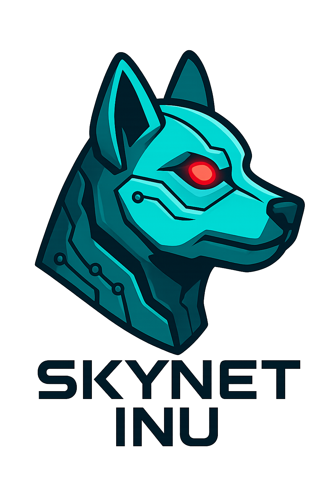

<!DOCTYPE html>
<html lang="en">
<head>
    <meta charset="UTF-8">
    <meta name="viewport" content="width=device-width, initial-scale=1.0">
    <title>Skynet Inu Whitepaper - The AI Memecoin on Solana</title>
    
    <link href="https://fonts.googleapis.com/css2?family=Orbitron:wght@400;700&family=Rajdhani:wght@400;600&display=swap" rel="stylesheet">
</head>
<body>
    

        

            
            <h1>SKYNET INU WHITEPAPER</h1>
            
The AI-Powered Memecoin Revolution

        

        
        

            <h2>1. Project Overview</h2>
            
Skynet Inu is a next-generation memecoin built on Solana, combining AI technology with decentralized finance to create unique utilities and community-driven growth.

            
            <h2>2. Tokenomics</h2>
            

                

                    <h3>1 Billion</h3>
                    
Total Supply

                

                

                    <h3>0%</h3>
                    
Buy/Sell Tax

                

                

                    <h3>100%</h3>
                    
Community Owned

                

            

            
            <h3>Distribution</h3>
            <ul>
                <li><strong>90% Liquidity</strong> - Locked on Raydium</li>
                <li><strong>10% Marketing</strong> - Community initiatives</li>
            </ul>
            
            <h2>3. Roadmap</h2>
            <h3>Phase 1: Launch</h3>
            <ul>
                <li>Smart contract deployment</li>
                <li>DEX liquidity setup</li>
                <li>Community building</li>
            </ul>
            
            <h3>Phase 2: Growth</h3>
            <ul>
                <li>CEX listings</li>
                <li>AI utility development</li>
                <li>Partnership announcements</li>
            </ul>
            
            <h3>Phase 3: Expansion</h3>
            <ul>
                <li>NFT integration</li>
                <li>Staking platform</li>
                <li>Ecosystem grants</li>
            </ul>
            
            <h2>4. How to Buy</h2>
            <ol>
                <li>Install Phantom wallet</li>
                <li>Purchase SOL tokens</li>
                <li>Connect to Raydium DEX</li>
                <li>Swap SOL for $SKYINU</li>
            </ol>
            
            <a href="https://skynet-inu.github.io/skynet-inu/" class="btn">BACK TO WEBSITE</a>
        

    

</body>
</html>
